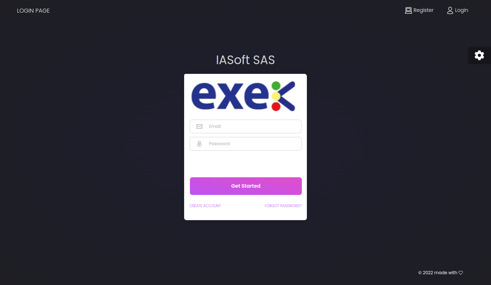
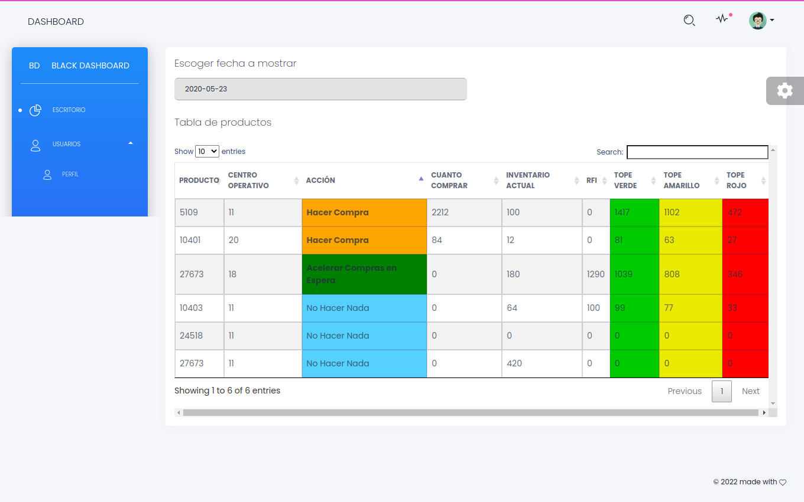
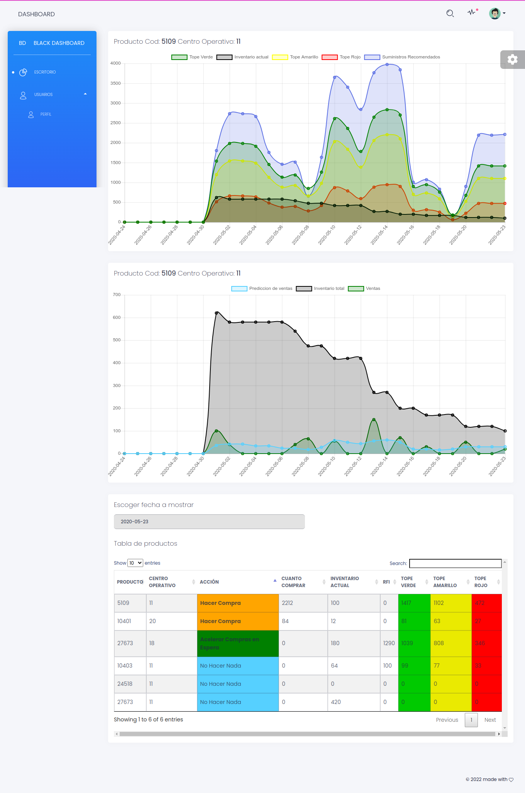

# SmartInventory
SmartInventory predicts sales and supplier response times, responses to customer demands and uses a recommender system for senior management decision making, using artificial intelligence


# SmartInventory environment
SmartInventory environment required to run Laravel (based on official php and mysql docker hub repositories).

[Source code](https://github.com/devopstoolsiasoft/smartinv)
[Imagen Docker](https://hub.docker.com/repository/docker/smartinventoryproductions1/smartinventory)

## Requirements
* Docker version Version: 20.10.17 or later
* Docker compose version  2.10.2 or later
* An editor or IDE

Note: OS recommendation - Linux Ubuntu based vesion 22.04.

## Components:
1. Apache 7.2.24
2. PHP 7.2.24 (cli) (Apache handler)
3. MySQL 5.7.29
4. Laravel Framework 5.8.33

## Setting up DEV environment
1.Clone this repository from GitHub.
```bash
git clone https://github.com/devopstoolsiasoft/smartinventory.git
Cloning into 'smartinventory'...
remote: Enumerating objects: 
```

2. Download image docker Docker Hub 
- have previously installed docker and docker-compose and login in docker hub
 ```bash
 cd smartinventory/
 docker login
 docker pull smartinventoryproductions1/smartinventory:latest
 ```
 The username and password for the Docker image download is provided by the provider.
 
- List the docker images
 ```bash 
 docker@docker:~/smartinv$ docker images
 REPOSITORY                   TAG                 IMAGE ID            CREATED             SIZE
 smartinventoryproductions1/smartinventory   latest    7c20ec4f134b   4 hours ago    2.2GB
 ```
3. Create docker services with docker-compose file
 ```bash
 docker@docker:~/smartinv$ docker compose up -d
 Creating network "smartinv_default" with the default driver
 Creating mysql ... done
 Creating supervisord           ... done
 Creating smartinv              ... done
 Creating smartinv_phpmyadmin_1 ... done
 ```
- Check containers, services and ports that are running
 ```bash
 docker@docker:~/smartinv$ docker compose ps -a
        Name                       Command               State                     Ports                   
 -----------------------------------------------------------------------------------------------------------
 mysql                   docker-entrypoint.sh --def ...   Up      0.0.0.0:33061->3306/tcp, 33060/tcp        
 smartinv                docker-php-entrypoint apac ...   Up      0.0.0.0:443->443/tcp, 0.0.0.0:8080->80/tcp
 smartinv_phpmyadmin_1   /docker-entrypoint.sh apac ...   Up      0.0.0.0:8081->80/tcp                      
 supervisord             docker-php-entrypoint /usr ...   Up      80/tcp                                    
 ```
 ```bash
 docker30@docker30:~/development_docker_test/test-clone-git-docker/smartinv$ docker ps -a
  NAME                  COMMAND                  SERVICE               STATUS              PORTS
mysql-smartinv        "docker-entrypoint.s…"   mysql-smartinv        running             33060/tcp, 0.0.0.0:33062->3306/tcp, :::33062->3306/tcp
phpmyadmin-smartinv   "/docker-entrypoint.…"   phpmyadmin-smartinv   running             0.0.0.0:9081->80/tcp, :::9081->80/tcp
smartinv              "docker-php-entrypoi…"   smartinv              running             0.0.0.0:443->443/tcp, :::443->443/tcp, 0.0.0.0:9080->80/tcp, :::9080->80/tcp
supervisord           "docker-php-entrypoi…"   supervisord           running             80/tcp

  ```
4. Verify web applications
- verify web applications on port 8080 smartinv in http://IP_HOST:9080/
- verify web applications phpmyadmin on port 8081 in http://IP_HOST:9081/

Por ejemplo: http://localhost:9080 o visitar el demo en: http://smartinv.tepuyrd.com/

<p align="center">
  
</p>

Usario por defecto:<br>
email:    demo@demo.com <br>
password: demo@demo.com <br>

<p align="center">
  
</p>

<p align="center">
  
</p>


5. Build and start the image from your terminal
 ```bash
 make start
 make stop
 ```

6.Set key for application:
 ```bash
 make ssh
 make ssh-mysql
 ```
7.Stop and clean the container
 ```bash
 make stop
 docker-compose down -v
 make clean
 ```
